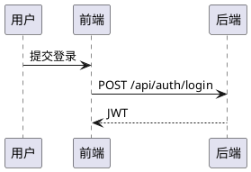

# Project Workspace And Section Editor Design

Date: 2026-06-08

## Decision

Improve the project workspace and section editor around four user-approved changes:

- When a project is open, replace the global sidebar with a project-specific sidebar.
- Section detail pages open in view mode. Users must click an edit button before changing content.
- Edit mode provides insert tools for tables, visual charts, PlantUML diagrams, and local images.
- Any unsaved edit is protected by a confirmation prompt before route changes, section switches, browser refresh, or browser close.

## Current State

The current frontend uses a global `Layout.vue` sidebar for all authenticated pages. Project pages also render `ProjectNav.vue`, a horizontal menu with project tabs such as overview, members, permissions, sections, files, tasks, progress, AI, statistics, and export.

The current section editor is `teamflow-ai-frontend/src/views/SectionEditor.vue`. It loads section detail, versions, and current section permissions. The title and body fields are always visible; editability is controlled only by `:disabled="!canEdit"`. There is no explicit view/edit mode, no insert toolbar, no rendered preview, and no unsaved-change route guard.

The backend already stores section content as `title` and `body` in `section_content`. File upload exists through `/api/files/upload`, but it is designed for project attachments and download behavior, not inline document images.

## Target User Experience

### Project Workspace Sidebar

When the user enters a project route such as `/projects/:id/overview`, the left sidebar changes from the global TeamFlowAI menu to a project-specific menu.

The project sidebar has three areas:

1. **Home**
   - A top item labeled `首页`.
   - Clicking it returns to the global workspace at `/dashboard`.

2. **Project Details**
   - A collapsible group labeled `项目详情`.
   - Contains project pages other than section detail:
     - 概述
     - 成员与申请
     - 权限矩阵
     - 附件
     - 任务
     - 进度
     - AI
     - 统计
     - 导出

3. **Specific Sections**
   - A section list labeled `具体章节`.
   - Loads project sections from `GET /api/projects/{id}/sections`.
   - Each item links directly to `/projects/:id/sections/:sectionId`.
   - The list should show enough status signal to distinguish draft, review, approved, rejected, and empty sections.

The old horizontal `ProjectNav.vue` should no longer appear on project pages once the project-specific sidebar is in place.

### Section View Mode

The section page opens in view mode by default.

View mode shows:

- Section title, description, status, and permissions.
- Rendered section content:
  - Plain text paragraphs.
  - Markdown-style tables.
  - ECharts chart blocks.
  - PlantUML diagram blocks.
  - Inline image blocks.
- Version records.
- Review and comment area, subject to existing permissions.

If the user has `EDIT` permission, show an `编辑` button unless the section is currently `REVIEWING`. Users without edit permission can still view content according to their `VIEW` permission, but they cannot enter edit mode.

Editable states in the first version:

- `EMPTY`: editing starts the first draft.
- `DRAFT`: editing updates by saving a newer draft version.
- `REJECTED`: editing saves a revised draft version.
- `APPROVED`: editing starts a new draft version for another review cycle.
- `REVIEWING`: editing is locked until review completes.

### Section Edit Mode

Clicking `编辑` switches the section content panel into edit mode.

Edit mode shows:

- Title input.
- Body editor.
- Insert toolbar:
  - 插入表格
  - 插入图表
  - 插入 PlantUML
  - 插入图片
- Preview area for rendered content.
- Save controls:
  - 保存草稿
  - 提交审核
  - 退出编辑

The editor should track dirty state by comparing current `title` and `body` against the last loaded or last saved values. After a successful save, dirty state resets.

## Content Block Format

Keep the backend section content model as text for this iteration. Store inserted objects inside `body` using structured fenced blocks so the frontend can parse and render them.

### Table

Tables use Markdown table syntax:

```markdown
| 列名 A | 列名 B |
| --- | --- |
| 示例 A | 示例 B |
```

### Chart

Charts use a fenced `teamflow-chart` block containing JSON:

````markdown
```teamflow-chart
{
  "type": "bar",
  "title": "任务完成情况",
  "categories": ["需求", "开发", "测试"],
  "series": [
    { "name": "完成数", "data": [4, 7, 3] }
  ]
}
```
````

Supported chart types in the first version:

- `bar`
- `line`
- `pie`

Rendering uses the existing ECharts dependency.

### PlantUML

PlantUML diagrams use a fenced `plantuml` block:

````markdown

````

The edit UI includes a small PlantUML editor panel:

- Code input.
- Preview area.
- Insert/update button.
- Preview error message when rendering fails.

PlantUML rendering should use a configurable frontend setting or helper function. If the rendering service is unavailable, keep the source block visible and show a non-destructive preview error. Saving the section must not depend on successful rendering.

### Image

Images use a Markdown image syntax with an API URL returned from upload:

```markdown

```

The insert image flow:

1. User clicks `插入图片`.
2. User selects a local image.
3. Frontend uploads the file.
4. Backend stores it as a project file associated with the current project and section.
5. Frontend inserts the image markdown into the body.
6. Preview renders the image inline.

Allowed image types:

- `image/png`
- `image/jpeg`
- `image/gif`
- `image/webp`

The existing upload size limit remains in force.

## Backend Changes

### File Upload

Enhance `POST /api/files/upload` to accept optional `sectionId`.

When `sectionId` is present:

- Verify the section exists.
- Verify it belongs to the provided project.
- Store `section_id` in `project_file`.

For section editor images, set `documentType=IMAGE`.

### Inline Image Endpoint

Add `GET /api/files/inline/{id}`.

Behavior:

- Reuse existing file access checks.
- Return the image with its original content type.
- Only allow image MIME types for inline rendering.
- Reject non-image files with a business error.
- Use inline content disposition rather than attachment.

Existing `GET /api/files/download/{id}` remains unchanged for normal attachments.

### Section Draft Saving

Update section draft saving so users with `EDIT` permission can start a new draft from an `APPROVED` section. The new save should create a fresh `DRAFT` content version and set the section status back to `DRAFT`.

Keep `REVIEWING` sections locked because there is already a submitted version awaiting review.

## Frontend Changes

### Project Layout

Introduce a project workspace layout or project sidebar component that activates for `/projects/:id/*` routes.

Responsibilities:

- Load project sections.
- Render `首页`.
- Render `项目详情` collapsible menu.
- Render `具体章节`.
- Highlight active project route or active section route.

Existing project pages should stop rendering the old horizontal `ProjectNav.vue` once the project-specific sidebar handles navigation.

### Section Editor

Refactor `SectionEditor.vue` into focused parts where practical:

- Section page container: loading data, permissions, version list, review/comment actions.
- Section content editor: view/edit mode, dirty tracking, save/submit controls.
- Insert tools:
  - table insertion.
  - chart insertion modal/panel.
  - PlantUML editor panel.
  - image upload insertion.
- Renderer:
  - render paragraphs and line breaks.
  - render Markdown tables.
  - render `teamflow-chart` blocks with ECharts.
  - render `plantuml` blocks.
  - render image markdown.

Use existing Element Plus controls. Keep the UI dense and work-focused rather than marketing-like.

### Unsaved Changes

When edit mode has dirty changes, protect against:

- Vue route changes.
- Clicking project sidebar links.
- Clicking return/navigation buttons.
- Browser refresh.
- Browser close.

The prompt should say that the section has unsaved updates and ask whether to save and update the section content.

Expected choices:

- Save and continue: run `saveSectionContent`, reset dirty state, then continue navigation.
- Continue without saving: discard current unsaved changes and continue navigation.
- Cancel: stay on the current page.

The browser close/refresh prompt can use the native `beforeunload` behavior. Because browsers limit custom text, it only needs to warn that changes may be lost.

## Error Handling

- If chart JSON is invalid, show a preview error and keep the raw block editable.
- If PlantUML preview fails, show the source block and an error message; do not block saving.
- If image upload fails, do not insert an image block.
- If save fails during a navigation guard, keep the user on the current page and show the backend error message.
- If a user lacks edit permission, hide or disable edit-only controls.

## Testing And Verification

Add focused frontend checks for:

- Project routes use the project-specific sidebar and no longer render `ProjectNav.vue`.
- Section editor starts in view mode.
- The edit button is required before fields become editable.
- Dirty changes trigger route-leave protection.
- Insert tools exist for table, chart, PlantUML, and image.
- Chart blocks render through ECharts.
- Image insertion uses `/api/files/upload` and renders `/api/files/inline/{id}`.

Run:

- `node` feature-check scripts added for this feature.
- `npm run build`.

Backend compile should be run with Maven when available:

- `mvn test -DskipTests`

This local workspace currently has no `mvn` command and no `mvnw`, so backend compile verification may need IntelliJ IDEA or a machine with Maven installed.

## Out Of Scope

- Collaborative real-time editing.
- Full rich-text editor integration.
- Drag-and-drop block rearranging.
- User-defined chart themes.
- Server-side PlantUML rendering.
- Exporting rendered diagrams as standalone image files.
